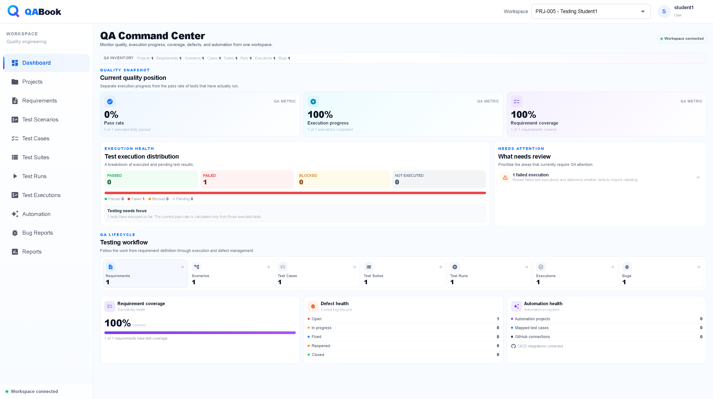
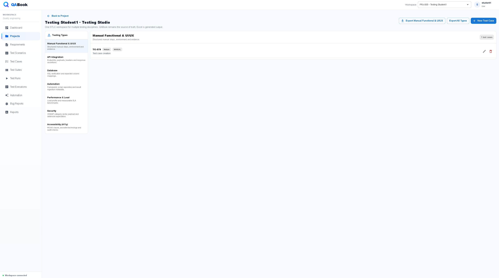
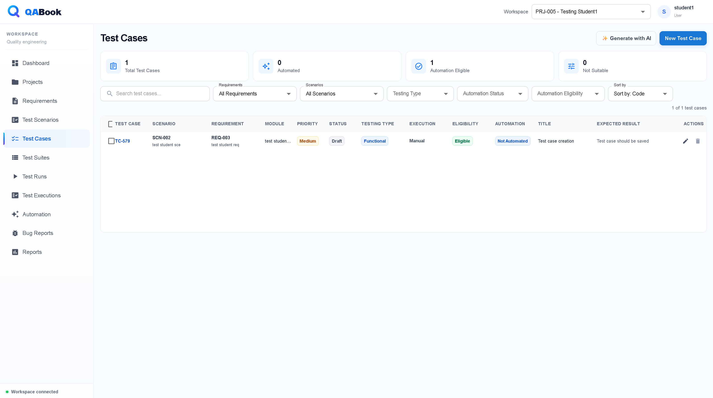
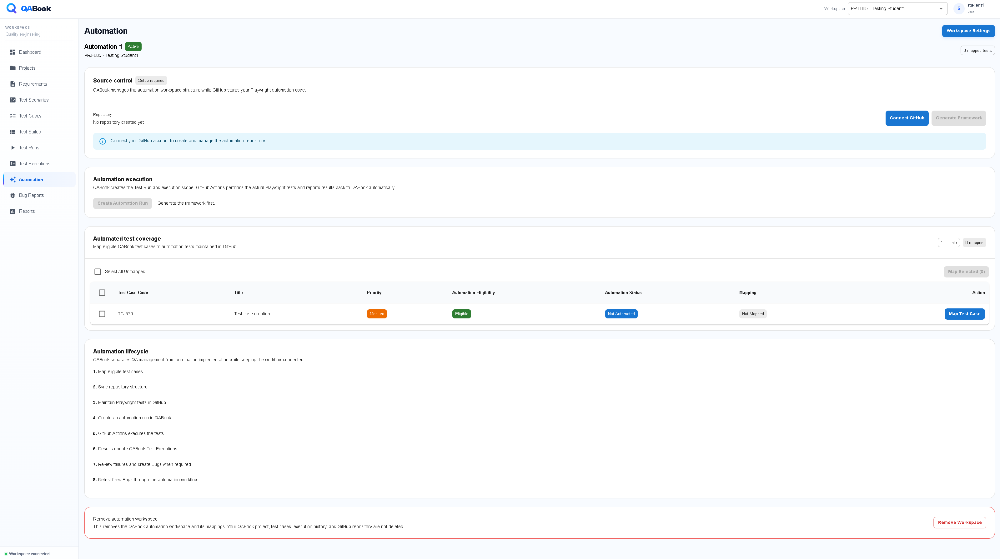
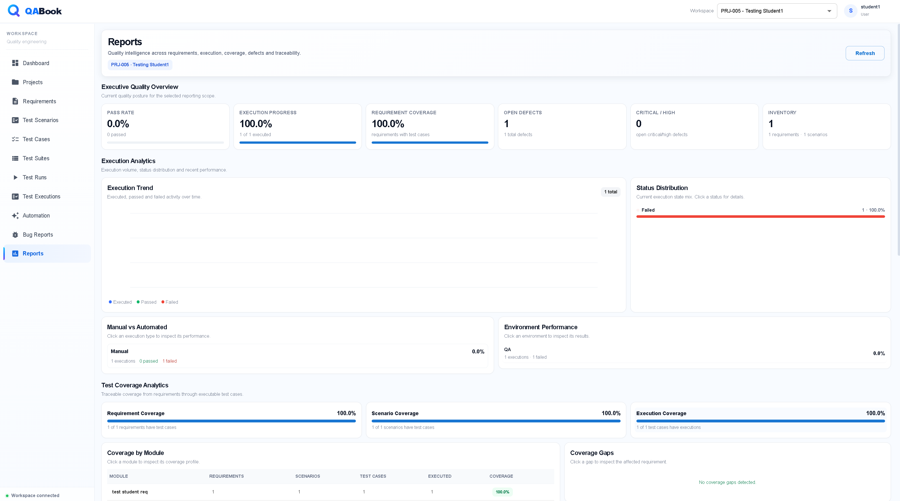
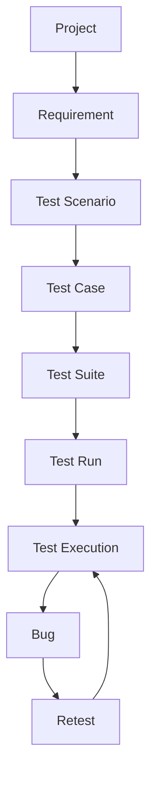
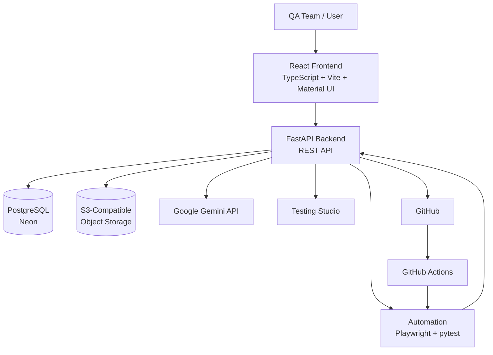

# QA Book

## AI-Powered QA Workspace for Modern Testing Teams

A full-stack Quality Assurance Management Platform that brings requirements, test cases, test execution, defects, AI-assisted QA, Testing Studio, automation, CI/CD, and reporting into a single workspace.

[](https://qa-book.vercel.app)
[](https://qabook-api.onrender.com/docs)
[](https://github.com/Rushis09/QA_Book)
[](LICENSE)

---

## Overview

QA Book is a full-stack QA management platform designed to manage the software testing lifecycle from requirements through execution, defects, retesting, automation, and reporting.

It provides project-based management for:

- Requirements
- Test Scenarios
- Test Cases
- Test Suites
- Test Runs
- Test Executions
- Bugs
- Retesting
- Testing Studio
- Documents
- Automation Projects
- Reporting & Analytics

QA Book also integrates:

- AI-assisted QA artifact generation
- BRD-based requirement generation
- GitHub integration
- Playwright/pytest automation
- GitHub Actions
- Automated execution
- Automated retesting
- Excel and PDF exports

Users work through individual accounts with project-based access to their QA data.

---

# Product Screenshots

## Dashboard



## Testing Studio



## Test Cases



## Automation



## Reports



---

# Why QA Book?

QA teams often manage requirements, test cases, execution results, defects, documents, automation, and reports across spreadsheets and multiple tools.

QA Book brings these activities together into one platform to provide:

- Centralized QA management
- Requirement-to-test traceability
- Structured test planning
- Manual and automated test execution
- Defect and retest management
- Multiple testing disciplines
- AI-assisted QA artifact creation
- Automation project management
- GitHub and CI/CD integration
- QA reporting and analytics
- Document and BRD management

---

# Feature Matrix

| Area | Capabilities |
|---|---|
| QA Management | Projects, Requirements, Test Scenarios, Test Cases, Test Suites |
| Test Execution | Test Runs, Manual Execution, Automated Execution, Execution Results |
| Defect Management | Bugs, Severity, Priority, Assignment, Resolution, Retesting |
| Testing Studio | Functional, API, Database, Automation, Performance, Security, Accessibility |
| AI | Requirement, Scenario, Test Case, Test Suite and BRD-assisted generation |
| Automation | Playwright/pytest, Automation Projects, Test Case Mapping |
| CI/CD | GitHub Integration, GitHub Actions, Automated Execution, Result Synchronization |
| Reporting | Quality Overview, Pass Rate, Coverage, Defects, Risk, Traceability |
| Documents | BRD Upload, DOCX/PDF Support, Object Storage |
| Export | Excel and PDF |
| Administration | User Management, Roles, Activation/Deactivation, Password Administration |

---

# QA Testing Lifecycle

QA Book supports the core QA lifecycle:

```text
Project
   ↓
Requirement
   ↓
Test Scenario
   ↓
Test Case
   ↓
Test Suite
   ↓
Test Run
   ↓
Test Execution
   ↓
Bug
   ↓
Retest
```

The lifecycle keeps QA artifacts connected so teams can move from requirements to scenarios, test cases, executions, defects, and retests.

### Visual Lifecycle



---

# Testing Studio

Testing Studio provides structured support for multiple testing disciplines within the same QA workspace.

## Supported Testing Types

- Functional Testing
- API Testing
- Database Testing
- Automation Testing
- Performance Testing
- Security Testing
- Accessibility Testing

Testing Studio supports discipline-specific test metadata while keeping test cases connected to the existing QA lifecycle.

## Execution Methods

- Manual
- Automated
- External
- Imported

## Testing Evidence

Testing evidence can be associated with testing workflows and stored using object storage.

Supported evidence formats:

- PNG
- JPG
- JPEG
- WEBP
- PDF
- TXT
- LOG

---

# User Authentication & Administration

QA Book supports individual user accounts and protected application access.

## Authentication

- User registration
- User login
- Access-token based authentication
- Protected application routes
- Account information
- Password change
- Forgot-password workflow
- Password reset
- User-scoped project access
- Role handling

## Administration

- User creation
- User management
- Role management
- User activation/deactivation
- Password administration
- Administrative access controls

---

# Project Management

Each project acts as a centralized QA workspace.

Project management includes:

- Create and manage projects
- Project ownership
- Project status
- Project version
- Start and end dates
- Project overview
- Project health information
- Project-level QA artifacts
- Project documents
- Project automation
- Project reporting
- Project exports
- Project settings
- Project deletion and impact handling

Project data remains associated with the appropriate user/project access boundaries.

---

# Requirement Management

QA Book provides structured requirement management.

Capabilities include:

- Create and manage requirements
- Requirement numbering
- Requirement status
- Requirement priority
- Requirement-to-test traceability
- Search
- Filtering
- Sorting
- AI-assisted requirement generation
- BRD-based requirement generation

---

# Test Scenario Management

Test scenarios can be created and connected to requirements.

Capabilities include:

- Create and manage scenarios
- Link scenarios to requirements
- Scenario status
- Scenario priority
- Requirement-based filtering
- Search and sorting
- AI-assisted scenario generation

---

# Test Case Management

QA Book provides detailed test-case management.

Test cases support:

- Requirements and scenario relationships
- Test case numbering
- Preconditions
- Test steps
- Expected results
- Priority
- Status
- Automation eligibility
- Automation status
- Project-based filtering
- AI-assisted test case generation

Test cases can subsequently be assigned to suites, executed through test runs, connected to defects, and retested.

---

# Test Suite Management

Test suites organize test cases into reusable testing collections.

Capabilities include:

- Create and manage suites
- Assign test cases to suites
- View suite coverage
- Track suite status
- Project-based suite management

---

# Test Run Management

Test runs represent a specific execution cycle.

Capabilities include:

- Create test runs from suites
- Manual execution
- Automated execution
- Build version information
- Environment information
- Tester information
- Run status
- Run configuration
- Execution result tracking
- Test run details
- Execution health tracking

---

# Test Execution

QA Book supports both manual and automated execution workflows.

Execution results include:

- Passed
- Failed
- Blocked
- Not Executed

Execution records can contain:

- Execution timestamps
- Executed-by information
- Execution details
- Test case context
- Defect relationships

Failed executions can be used as the starting point for defect management and retesting.

---

# Bug Management

QA Book connects defects directly to the testing lifecycle.

Bug management includes:

- Create and manage defects
- Bug severity
- Bug priority
- Bug status workflow
- Assignment
- Preconditions
- Expected results
- Reproduction steps
- Test case context
- Resolution tracking
- Execution traceability
- Manual retesting
- Automated retesting

Typical defect lifecycle:

```text
Failed Execution
       ↓
      Bug
       ↓
      Fix
       ↓
     Retest
       ↓
 Passed / Failed
```

---

# Retesting

QA Book supports both manual and automated retesting.

Automated retesting can be connected to the original failed execution and bug context.

```text
Failed Test Execution
        ↓
       Bug
        ↓
      Retest
        ↓
Automated Retest Run
        ↓
 GitHub Actions
        ↓
 Automation Test
        ↓
 Updated Execution
```

This keeps defect verification connected to the original QA records.

---

# BRD Document Management

QA Book supports project-level BRD document management.

Supported document formats:

- DOCX
- PDF

Capabilities include:

- Upload BRD documents
- Store documents in object storage
- View project documents
- Download documents
- Delete documents
- Use uploaded BRD content for AI-assisted requirement generation

---

# AI-Assisted QA

QA Book uses AI to assist with QA artifact creation and analysis.

Current AI-assisted capabilities include:

- Requirement generation
- Test scenario generation
- Test case generation
- Test suite assistance
- BRD-based requirement analysis
- AI-assisted QA workflows

## AI Credentials

AI configuration is supported through the application settings.

AI credentials are handled through the platform's credential-management layer rather than being exposed directly as normal application data.

---

# Automation

QA Book provides a project-based automation workspace for connecting QA test cases with executable automation.

## Automation Capabilities

- Automation project management
- Test case-to-automation mapping
- Automation test configuration
- Playwright/pytest automation generation
- GitHub repository integration
- GitHub Actions integration
- Automated test execution
- Execution result synchronization
- Automated retesting
- Run-specific retest execution
- Bug-to-retest traceability

---

# Automation Framework Generation

QA Book can generate a Python-based Playwright/pytest automation framework for an automation project.

Generated automation projects can include:

```text
README.md
requirements.txt
pytest.ini
conftest.py
.env.example
.gitignore

.github/
└── workflows/
    └── qabook.yml

qabook/
└── manifest.json

pages/
└── base_page.py

utils/
├── config.py
├── manifest.py
└── qabook_client.py

tests/
└── ...
```

The generated framework provides the foundation for implementing executable automation mapped to QA Book test cases.

---

# GitHub Integration

QA Book integrates with GitHub to connect QA automation projects with source repositories.

The integration supports:

- GitHub connection
- GitHub OAuth
- Repository integration
- Automation project repository association
- GitHub Actions workflows
- Automation execution
- Retest execution
- Result synchronization with QA Book

---

# Automation & CI/CD Workflow

The automation workflow connects QA management with executable automation:

```text
QA Book
   ↓
Automation Project
   ↓
Test Case Mapping
   ↓
Generated Playwright / pytest Framework
   ↓
GitHub Repository
   ↓
GitHub Actions
   ↓
Automated Test Execution
   ↓
QA Book CI API
   ↓
Test Run / Test Execution
   ↓
Bug
   ↓
Automated Retest
```

This allows automated testing results to remain connected to the same requirements, test cases, executions, bugs, and retests managed inside QA Book.

---

# Reporting & Analytics

QA Book provides project-aware and global QA reporting.

Reporting areas include:

- Executive quality overview
- Pass rate
- Execution progress
- Requirement coverage
- Open defects
- Critical/high defects
- Execution analytics
- Test coverage analytics
- Defect intelligence
- Quality risk
- Traceability intelligence
- Interactive report drill-down

Reports allow users to move from aggregate metrics to the underlying QA records.

Example:

```text
Requirement
    ↓
Scenario
    ↓
Test Case
    ↓
Test Run
    ↓
Execution
    ↓
Bug
    ↓
Retest
```

---

# Export

QA Book supports export capabilities for QA artifacts and project information.

Available export areas include:

- Project export
- Requirements export
- Test scenario export
- Test case export
- Test suite export
- Test run export
- Bug report export
- Excel export
- PDF export

---

# Architecture

## System Architecture



### Architecture Overview

The platform consists of:

- React + TypeScript frontend
- FastAPI backend
- PostgreSQL database
- S3-compatible object storage
- Google Gemini API
- Testing Studio
- Playwright/pytest automation
- GitHub integration
- GitHub Actions

---

# Backend Architecture

The backend follows a layered architecture:

```text
FastAPI Routes
      ↓
Service Layer
      ↓
Repository Layer
      ↓
SQLAlchemy Models
      ↓
PostgreSQL
```

Additional integrations include:

```text
FastAPI
 ├── AI Services
 ├── Testing Studio
 ├── Automation
 ├── Administration
 ├── GitHub Integration
 ├── Document Storage
 └── Reporting
```

Database schema changes are managed through Alembic migrations.

---

# Frontend Architecture

The frontend is built using React and TypeScript.

The application uses:

```text
React Components
      ↓
Pages / Feature Modules
      ↓
Frontend Service Layer
      ↓
Axios
      ↓
FastAPI REST API
```

The frontend contains dedicated workflows for:

- Projects
- Requirements
- Scenarios
- Test Cases
- Test Suites
- Test Runs
- Executions
- Bugs
- Retests
- Testing Studio
- Automation
- Reports
- Documents
- Administration
- Settings

---

# Tech Stack

## Frontend

[](https://react.dev/)
[](https://www.typescriptlang.org/)
[](https://vitejs.dev/)
[](https://mui.com/)
[](https://axios-http.com/)

- React 19
- TypeScript
- Vite
- Material UI
- Axios
- React Router

## Backend

[](https://www.python.org/)
[](https://fastapi.tiangolo.com/)
[](https://www.sqlalchemy.org/)

- Python
- FastAPI
- SQLAlchemy
- Alembic
- Pydantic
- Boto3

## Database & Storage

[](https://www.postgresql.org/)
[](https://neon.tech/)

- PostgreSQL
- Neon PostgreSQL
- S3-compatible object storage

## AI

[](https://ai.google.dev/)

- Google Gemini API

## Testing & Automation

[](https://playwright.dev/)
[](https://pytest.org/)
[](https://github.com/features/actions)

- Playwright
- pytest
- GitHub Actions

## Version Control & CI/CD

[](https://git-scm.com/)
[](https://github.com/)

- Git
- GitHub
- GitHub Actions

## Deployment

[](https://vercel.com/)
[](https://render.com/)

- Vercel
- Render
- Neon PostgreSQL
- S3-compatible object storage

---

# Project Structure

```text
QA_Book/
│
├── apps/
│   ├── api/
│   │   ├── app/
│   │   │   ├── administration/
│   │   │   ├── ai/
│   │   │   ├── api/
│   │   │   ├── automation/
│   │   │   ├── auth/
│   │   │   ├── models/
│   │   │   ├── repositories/
│   │   │   ├── schemas/
│   │   │   ├── services/
│   │   │   └── testing_studio/
│   │   │
│   │   └── alembic/
│   │
│   └── web/
│       └── src/
│           ├── components/
│           ├── config/
│           ├── contexts/
│           ├── pages/
│           ├── services/
│           └── types/
│
├── .github/
│   └── workflows/
│
├── docs/
├── docker/
├── scripts/
├── .gitignore
├── LICENSE
└── README.md
```

---

# Continuous Integration

QA Book uses GitHub Actions for repository-level CI.

The current CI pipeline validates the backend and frontend.

```text
Git Push / Pull Request
          ↓
     GitHub Actions
          ↓
     ┌────┴────┐
     │         │
 Backend    Frontend
     │         │
Dependencies  npm ci
     │         │
App Import   npm build
     │         │
     └────┬────┘
          ↓
       CI PASS
```

## Backend CI

The backend CI process:

- Runs on Ubuntu
- Sets up Python 3.13
- Installs backend dependencies
- Uses CI database configuration
- Uses CI-safe configuration
- Verifies FastAPI application initialization

## Frontend CI

The frontend CI process:

- Runs on Ubuntu
- Sets up Node.js 22
- Uses npm dependency installation
- Uses npm cache
- Runs the production build

---

# Local Development

## Clone Repository

```bash
git clone https://github.com/Rushis09/QA_Book.git
cd QA_Book
```

---

## Backend Setup

```bash
cd apps/api
```

Create a virtual environment:

```bash
python -m venv .venv
```

### Windows

```powershell
.venv\Scripts\activate
```

Install dependencies:

```bash
pip install -r requirements.txt
```

Create a `.env` file with the required configuration.

Example:

```env
DATABASE_URL=YOUR_DATABASE_URL
GEMINI_API_KEY=YOUR_GEMINI_API_KEY
AWS_ENDPOINT_URL_S3=YOUR_S3_ENDPOINT
AWS_ACCESS_KEY_ID=YOUR_ACCESS_KEY
AWS_SECRET_ACCESS_KEY=YOUR_SECRET_KEY
AWS_REGION=YOUR_REGION
AWS_S3_BUCKET=YOUR_BUCKET
```

Run the backend:

```bash
uvicorn app.main:app --reload
```

Backend:

```text
http://localhost:8000
```

Swagger documentation:

```text
http://localhost:8000/docs
```

---

# Frontend Setup

```bash
cd apps/web
npm ci
```

Configure the frontend API URL.

Example:

```env
VITE_PRODUCTION_API_URL=http://localhost:8000
```

Run the development server:

```bash
npm run dev
```

Frontend:

```text
http://localhost:5173
```

Production build:

```bash
npm run build
```

---

# Deployment

QA Book is deployed as a cloud-based application.

| Component | Platform |
|---|---|
| Frontend | Vercel |
| Backend | Render |
| Database | Neon PostgreSQL |
| Object Storage | S3-compatible storage |
| Source Control | GitHub |
| CI/CD | GitHub Actions |

## Live Application

https://qa-book.vercel.app

## Backend API

https://qabook-api.onrender.com

## API Documentation

https://qabook-api.onrender.com/docs

---

# Development Practices

QA Book follows a layered full-stack architecture with separation between:

- Frontend components
- Frontend services
- API routes
- Business services
- Repositories
- Database models
- External integrations

Development practices include:

- Database migrations with Alembic
- API validation with Pydantic
- Authentication and access control
- Reusable React components
- Service/repository architecture
- Error handling
- Functional testing
- UI workflow validation
- Integration testing
- End-to-end workflow validation
- Git-based version control
- Automated CI validation

---

# Documentation

Detailed technical documentation is available in the `docs/` directory.

| Document | Description |
|---|---|
| [Architecture](docs/Architecture.md) | System and application architecture |
| [API](docs/API.md) | API documentation |
| [Database](docs/Database.md) | Database documentation |
| [Deployment](docs/Deployment.md) | Deployment documentation |
| [Git & GitHub](docs/Git.md) | Git workflow and CI/CD documentation |
| [Roadmap](docs/Roadmap.md) | Project roadmap |

### Online API Documentation

[Open Swagger API Documentation](https://qabook-api.onrender.com/docs)

---

# Current Platform

The current platform includes:

- Individual user authentication
- Password reset and account management
- Project management
- Requirements
- Test scenarios
- Test cases
- Test suites
- Test runs
- Test executions
- Bug tracking
- Manual retesting
- Automated retesting
- Testing Studio
- Functional testing support
- API testing support
- Database testing support
- Automation testing support
- Performance testing support
- Security testing support
- Accessibility testing support
- Testing evidence
- Automation project management
- Test case automation mapping
- Playwright/pytest automation generation
- GitHub integration
- GitHub Actions automation
- Automated test execution
- Execution result synchronization
- AI-assisted QA artifact generation
- BRD document management
- AI-assisted BRD requirement generation
- Reporting and analytics
- Interactive traceability
- Excel export
- PDF export
- Object storage integration
- Platform administration
- Production cloud deployment
- GitHub Actions CI

---

# Planned Improvements

Potential future improvements include:

- Expanded automated backend test coverage
- Stronger frontend linting and CI quality gates
- Expanded AI-assisted test generation
- AI-assisted bug summaries
- AI-assisted risk analysis
- Additional reporting capabilities
- Continuous deployment automation
- Further automation framework improvements
- Additional testing integrations

---

# Contributing

If you'd like to contribute:

1. Fork the repository.
2. Create a feature branch.
3. Develop and test the feature.
4. Review your changes with Git.
5. Commit the changes.
6. Open a Pull Request.

---

# My Contribution

Designed and developed the QA Book platform across product, QA workflow, frontend, backend, automation, AI, and deployment layers.

Key contributions include:

- Defined the overall QA Book product concept and QA lifecycle
- Designed the project-based QA management workflow
- Designed and implemented the database structure
- Developed the frontend using React, TypeScript, Vite, and Material UI
- Developed the backend using FastAPI, SQLAlchemy, Pydantic, and Alembic
- Implemented REST APIs and service/repository architecture
- Implemented authentication and project access control
- Implemented project, requirement, scenario, test case, suite, run, execution, and bug workflows
- Implemented manual and automated retesting
- Implemented Testing Studio workflows
- Implemented multiple testing-discipline support
- Implemented AI-assisted QA artifact generation
- Implemented BRD document upload and AI-assisted requirement generation
- Integrated PostgreSQL and object storage
- Implemented reporting, analytics, traceability, and interactive drill-down
- Implemented automation project management
- Implemented Playwright/pytest automation generation
- Integrated GitHub and GitHub Actions
- Implemented automated execution and retesting workflows
- Implemented platform administration capabilities
- Validated features through functional, UI, integration, and end-to-end testing
- Deployed the application using Vercel, Render, and Neon
- Used AI-assisted development while reviewing, testing, and validating the resulting implementation

---

# Author

**Rushikesh**

GitHub:

https://github.com/Rushis09/QA_Book

---

# License

This project is licensed under the MIT License.

See the [LICENSE](LICENSE) file for details.